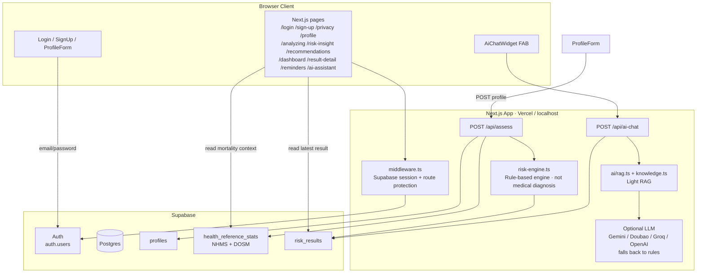
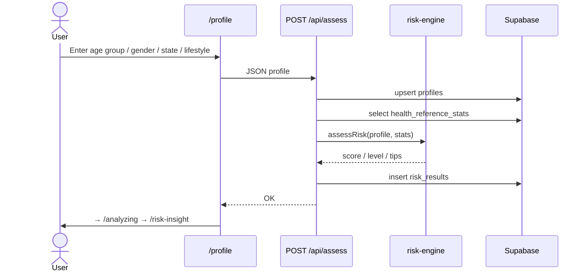

# SihatQ Web App

Next.js + Supabase MVP：注册登录 → 填 Profile → 规则算风险 → 对比 NHMS 公开统计。

> Preventive insight only — **not** a medical diagnosis.

---

## 0. 你需要准备什么

1. 已安装 **Node.js**（本机已有即可）
2. 一个 **Supabase** 账号：[https://supabase.com](https://supabase.com)（可用 GitHub 登录）

3.（可选，最后部署）**Vercel** 账号：[https://vercel.com](https://vercel.com)

---

## 1. 创建 Supabase 项目（点哪里）

1. 打开 Supabase → **New project**
2. Organization 选默认即可
3. **Name**：例如 `sihatq`
4. **Database Password**：自己设一个并保存好
5. **Region**：建议选 **Singapore**
6. 点 **Create new project**，等 1–2 分钟变绿

### 复制 API 密钥

1. 左侧 **Project Settings**（齿轮）→ **API**
2. 复制：
  - **Project URL**（形如 `https://xxxx.supabase.co`）
  - **anon public** key（一长串 JWT）

### 关闭邮箱确认（方便课堂演示）

1. 左侧 **Authentication** → **Providers** → **Email**
2. 关闭 **Confirm email**（或等价选项）
3. 保存

这样注册后能立刻登录，不用等邮件。

---

## 2. 建表 + 导入 NHMS 种子数据

1. 左侧打开 **SQL Editor** → **New query**
2. 打开本仓库文件：`[supabase/migrations/001_init.sql](supabase/migrations/001_init.sql)`
3. 全选复制 → 粘贴到 SQL Editor → 点 **Run**
4. 期望：成功、无报错
5. 左侧 **Table Editor** 应能看到：
  - `profiles`
  - `health_reference_stats`（里面有 4 条 NHMS 2023 数据）
  - `risk_results`

CSV 备份在：`[supabase/seed/nhms_2023_key_findings.csv](supabase/seed/nhms_2023_key_findings.csv)`

### 可选：导入 DOSM 死亡数据（2024 deaths）

1. 再开一个 SQL query
2. 运行 `[supabase/migrations/002_seed_dosm_causes_of_death_2024.sql](supabase/migrations/002_seed_dosm_causes_of_death_2024.sql)`
3. `health_reference_stats` 会多几条 DOSM 死因背景数据（IHD、pneumonia、diabetes deaths、transport accidents）

CSV：`[supabase/seed/dosm_causes_of_death_2024_mvp.csv](supabase/seed/dosm_causes_of_death_2024_mvp.csv)`  
来源：DOSM *Statistics on Causes of Death, Malaysia, 2025*（统计的是 2024 年死亡）。  
用途：全国死亡背景 / AI 解释引用；**不是诊断模型**。现有评估页面仍主要用 NHMS 患病率对比。

---

## 3. 本地启动前端

在终端进入 `web` 目录：

```bash
cd web
cp .env.local.example .env.local
```

用编辑器打开 `.env.local`，填入刚才复制的值：

```env
NEXT_PUBLIC_SUPABASE_URL=https://你的项目.supabase.co
NEXT_PUBLIC_SUPABASE_PUBLISHABLE_KEY=你的_sb_publishable_密钥
```

（官方文档里的 Publishable key = 以前说的 anon key，是同一类“可放前端”的钥匙。）

然后安装依赖并启动：

```bash
npm install
npm run dev
```

浏览器打开：[http://localhost:3000](http://localhost:3000)

### 后台管理系统（Admin）

登录后打开：[http://localhost:3000/admin](http://localhost:3000/admin)

- **Overview**：profiles / assessments / reference stats 数量
- **Reference stats**：查看并增删改 NHMS / DOSM 数据
- **Assessments**：查看全部用户最近评估（只读）

在 `.env.local` 中配置：

```env
ADMIN_EMAILS=you@example.com
SUPABASE_SERVICE_ROLE_KEY=your_service_role_key
```

说明：
- 必须设置 `ADMIN_EMAILS`（逗号分隔）作为**首个管理员兜底**；也可在 Users 页把别人设为 admin
- 先在 Supabase 运行 `[supabase/migrations/003_user_roles.sql](supabase/migrations/003_user_roles.sql)`，才能 Make admin / Remove admin
- 没有 `SUPABASE_SERVICE_ROLE_KEY` 时仍可打开页面；跨用户统计与写入需要该密钥（**只放服务器，勿提交 Git**）

### 演示路径

1. **Sign up** 注册
2. **Privacy** 点同意
3. **Profile** 勾选例如：`46-60` + family Diabetes + High Sugar
4. 看 **Risk Insight** 与 **Recommendations**

---

## 4. 项目结构（你只需要知道这些）


| 路径                                 | 作用                                                      |
| ---------------------------------- | ------------------------------------------------------- |
| `src/app/`*                        | 页面（home、login、profile、insight、result-detail、reminders…） |
| `src/app/api/assess/route.ts`      | 保存 profile + 算风险                                        |
| `src/app/admin/*`                  | 后台：概览 / 参考统计 CRUD / 评估列表                             |
| `src/lib/risk-engine.ts`           | 规则引擎（if/else，不是 AI）                                     |
| `src/lib/supabase/*`               | Supabase 客户端                                            |
| `supabase/migrations/001_init.sql` | 数据库表 + RLS + NHMS 种子                                    |


---

## 5. Architecture (English)

### Entity Relationship Diagram (ERD)

```mermaid
erDiagram
  auth_users ||--|| profiles : "1:1 owns"
  auth_users ||--o{ risk_results : "1:N has"
  health_reference_stats }o..o{ risk_results : "used at assess time (no FK)"
  profiles }o..o{ risk_results : "same user_id (no FK)"

  auth_users {
    uuid id PK
    text email
  }

  profiles {
    uuid id PK
    uuid user_id UK_FK
    text age_group
    text gender
    text state
    jsonb lifestyle
    jsonb family_history
    timestamptz privacy_accepted_at
    timestamptz created_at
    timestamptz updated_at
  }

  risk_results {
    uuid id PK
    uuid user_id FK
    text risk_category
    text risk_level
    text explanation
    text comparison_text
    jsonb recommendations
    numeric your_score
    numeric national_benchmark
    timestamptz created_at
  }

  health_reference_stats {
    uuid id PK
    text indicator
    int year
    text state
    text age_group
    text gender
    numeric value
    text unit
    text source_title
    text source_url
    timestamptz created_at
  }
```

**Relationships**
- `auth.users` → `profiles`: one-to-one (`user_id` unique)
- `auth.users` → `risk_results`: one-to-many (one row per assessment)
- `health_reference_stats`: public reference table (NHMS prevalence + DOSM mortality); read at assess time, **no foreign key**; values feed `risk_results.national_benchmark` / `comparison_text`

### Overall architecture



**Layers**
- **Frontend:** pages, forms, AI chat widget
- **Application:** auth middleware, assess API, AI API, rule engine, local knowledge base
- **Data:** Supabase Auth + `profiles` / `health_reference_stats` / `risk_results`

### Main assessment flow



---

## 6. 安全提醒（presentation 也要说）

- 前端只用 **anon key**，不要把 **service_role** 放进网页
- 数据库开了 **RLS**：用户只能读写自己的 profile / risk_results
- 不存 NRIC、真实生日、精确地址
- `.env.local` 已在 `.gitignore`，不要提交到 GitHub
- 页面写明：这是 preventive insight，不是诊断

---

## 7. 部署到 Vercel（可选）

1. 把代码 push 到 GitHub
2. Vercel → **Add New Project** → 选这个仓库
3. **Root Directory** 设为 `web`
4. Environment Variables 添加：
  - `NEXT_PUBLIC_SUPABASE_URL`
  - `NEXT_PUBLIC_SUPABASE_PUBLISHABLE_KEY`
5. Deploy
6. 回到 Supabase → **Authentication** → **URL Configuration**
  - Site URL 改成你的 Vercel 域名
  - Redirect URLs 加上 `https://你的域名/`**

---

## 8. 卡住了先查这三处

1. `.env.local` 是否填对、是否重启过 `npm run dev`
2. SQL migration 是否在 Supabase 跑成功
3. 浏览器 F12 → Console / Network 的报错信息

需要帮助时，把报错原文发给队友或导师即可。