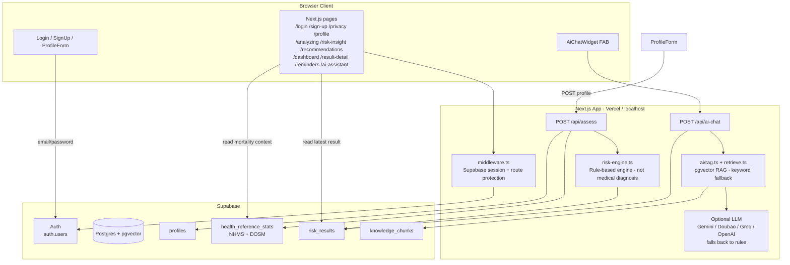
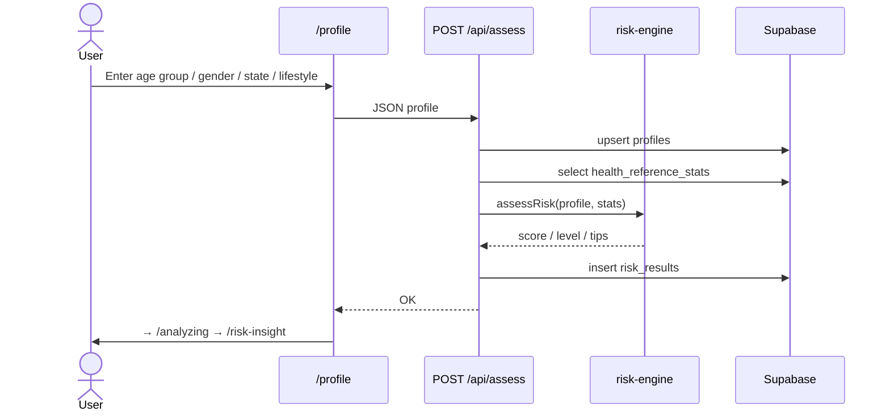
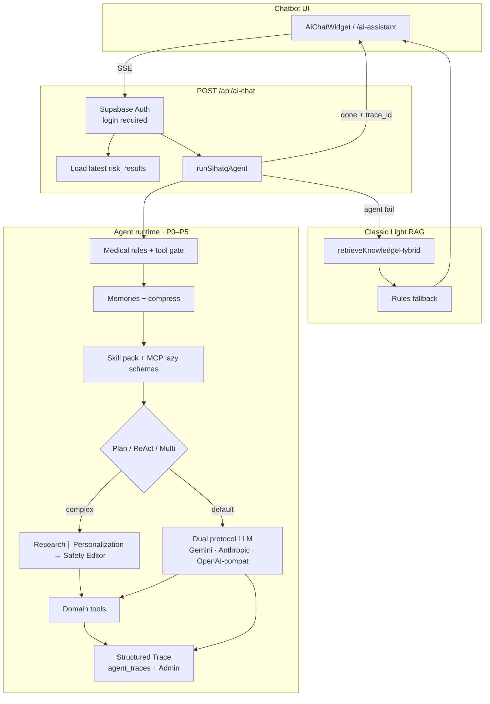
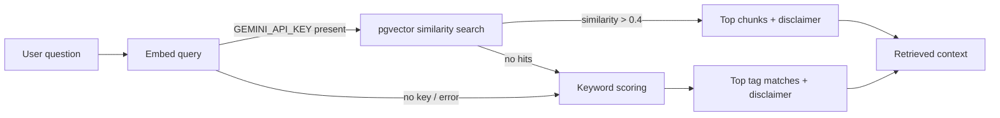
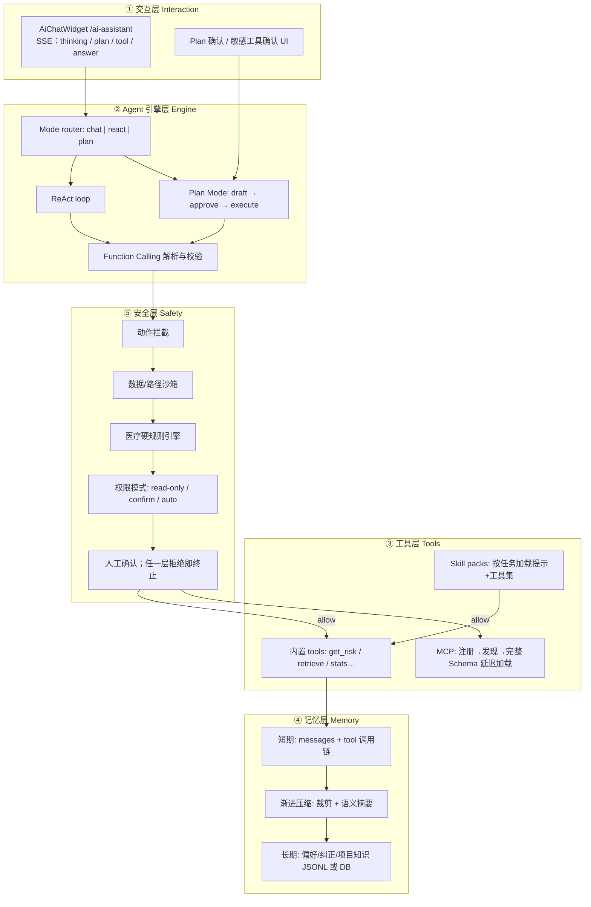
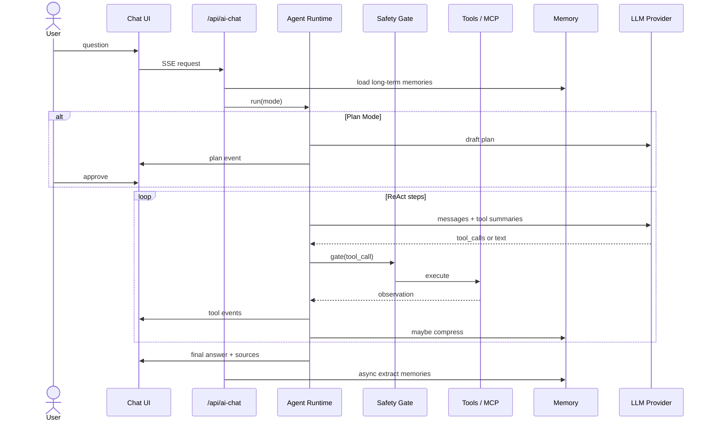

# SihatQ Web App

Next.js + Supabase MVP：注册登录 → 填 Profile → 规则算风险 → 对比 NHMS 公开统计。

> Preventive insight only — **not** a medical diagnosis.

---

## 0. 你需要准备什么

1. 已安装 **Node.js**（本机已有即可）
2. 一个 **Supabase** 账号：[https://supabase.com](https://supabase.com)（可用 GitHub 登录）

3.（可选，最后部署）**Vercel** 账号：[https://vercel.com](https://vercel.com)

---

## 1. 创建 Supabase 项目（点哪里）

1. 打开 Supabase → **New project**
2. Organization 选默认即可
3. **Name**：例如 `sihatq`
4. **Database Password**：自己设一个并保存好
5. **Region**：建议选 **Singapore**
6. 点 **Create new project**，等 1–2 分钟变绿

### 复制 API 密钥

1. 左侧 **Project Settings**（齿轮）→ **API**
2. 复制：
  - **Project URL**（形如 `https://xxxx.supabase.co`）
  - **anon public** key（一长串 JWT）

### 关闭邮箱确认（方便课堂演示）

1. 左侧 **Authentication** → **Providers** → **Email**
2. 关闭 **Confirm email**（或等价选项）
3. 保存

这样注册后能立刻登录，不用等邮件。

---

## 2. 建表 + 导入 NHMS 种子数据

1. 左侧打开 **SQL Editor** → **New query**
2. 打开本仓库文件：`[supabase/migrations/001_init.sql](supabase/migrations/001_init.sql)`
3. 全选复制 → 粘贴到 SQL Editor → 点 **Run**
4. 期望：成功、无报错
5. 左侧 **Table Editor** 应能看到：
  - `profiles`
  - `health_reference_stats`（里面有 4 条 NHMS 2023 数据）
  - `risk_results`

CSV 备份在：`[supabase/seed/nhms_2023_key_findings.csv](supabase/seed/nhms_2023_key_findings.csv)`

### 可选：导入 DOSM 死亡数据（2024 deaths）

1. 再开一个 SQL query
2. 运行 `[supabase/migrations/002_seed_dosm_causes_of_death_2024.sql](supabase/migrations/002_seed_dosm_causes_of_death_2024.sql)`
3. `health_reference_stats` 会多几条 DOSM 死因背景数据（IHD、pneumonia、diabetes deaths、transport accidents）

CSV：`[supabase/seed/dosm_causes_of_death_2024_mvp.csv](supabase/seed/dosm_causes_of_death_2024_mvp.csv)`  
来源：DOSM *Statistics on Causes of Death, Malaysia, 2025*（统计的是 2024 年死亡）。  
用途：全国死亡背景 / AI 解释引用；**不是诊断模型**。现有评估页面仍主要用 NHMS 患病率对比。

---

## 3. 本地启动前端

在终端进入 `web` 目录：

```bash
cd web
cp .env.local.example .env.local
```

用编辑器打开 `.env.local`，填入刚才复制的值：

```env
NEXT_PUBLIC_SUPABASE_URL=https://你的项目.supabase.co
NEXT_PUBLIC_SUPABASE_PUBLISHABLE_KEY=你的_sb_publishable_密钥
```

（官方文档里的 Publishable key = 以前说的 anon key，是同一类“可放前端”的钥匙。）

然后安装依赖并启动：

```bash
npm install
npm run dev
```

浏览器打开：[http://localhost:3000](http://localhost:3000)

### 后台管理系统（Admin）

登录后打开：[http://localhost:3000/admin](http://localhost:3000/admin)

- **Overview**：profiles / assessments / reference stats 数量
- **Reference stats**：查看并增删改 NHMS / DOSM 数据
- **Assessments**：查看全部用户最近评估（只读）

在 `.env.local` 中配置：

```env
ADMIN_EMAILS=you@example.com
SUPABASE_SERVICE_ROLE_KEY=your_service_role_key
```

说明：
- 必须设置 `ADMIN_EMAILS`（逗号分隔）作为**首个管理员兜底**；也可在 Users 页把别人设为 admin
- 先在 Supabase 运行 `[supabase/migrations/003_user_roles.sql](supabase/migrations/003_user_roles.sql)`，才能 Make admin / Remove admin
- 没有 `SUPABASE_SERVICE_ROLE_KEY` 时仍可打开页面；跨用户统计与写入需要该密钥（**只放服务器，勿提交 Git**）

### 可选：Upstash Redis 缓存

用于缓存公开的 `health_reference_stats`（评估 API + DOSM 卡片），后台改统计时会自动清缓存。

1. 打开 [Upstash Console](https://console.upstash.com) → Create Database（Redis）
2. 复制 **REST URL** 和 **REST TOKEN**
3. 写入 `.env.local`（或 Vercel Environment Variables）：

```env
UPSTASH_REDIS_REST_URL=https://xxxx.upstash.io
UPSTASH_REDIS_REST_TOKEN=your_token
```

4. 重启 `npm run dev`  
未配置时应用照常运行，只是跳过缓存。

### 可选：pgvector RAG（AI 知识检索）

把 NHMS/DOSM 知识片段存进 Postgres + 向量检索；失败时自动回退关键词 RAG。

1. Supabase SQL Editor 运行 `[supabase/migrations/004_pgvector_knowledge.sql](supabase/migrations/004_pgvector_knowledge.sql)`  
   （若提示 extension 权限，先在 Database → Extensions 启用 **vector**）
2. 本地生成并写入 embeddings：

```bash
cd web
npm run seed:knowledge
```

需要：`SUPABASE_SERVICE_ROLE_KEY` + `GEMINI_API_KEY`  
3. 重启 `npm run dev`，问 AI 后看 API 响应里的 `retrieval: "pgvector"`（成功）或 `"keyword"`（回退）

### 演示路径

1. **Sign up** 注册
2. **Privacy** 点同意
3. **Profile** 勾选例如：`46-60` + family Diabetes + High Sugar
4. 看 **Risk Insight** 与 **Recommendations**

---

## 4. 项目结构（你只需要知道这些）


| 路径                                 | 作用                                                      |
| ---------------------------------- | ------------------------------------------------------- |
| `src/app/`*                        | 页面（home、login、profile、insight、result-detail、reminders…） |
| `src/app/api/assess/route.ts`      | 保存 profile + 算风险                                        |
| `src/app/admin/*`                  | 后台：概览 / 参考统计 CRUD / 评估列表                             |
| `src/lib/risk-engine.ts`           | 规则引擎（if/else，不是 AI）                                     |
| `src/lib/redis.ts`                 | 可选 Upstash Redis：缓存公开健康统计                              |
| `src/lib/ai/retrieve.ts`           | 混合检索：pgvector 优先，关键词兜底                               |
| `src/lib/agent/*`                  | P0–P2 Agent：ReAct、Plan、安全、记忆与压缩                 |
| `supabase/migrations/005_agent_memories.sql` | 跨会话 agent_memories + RLS + project 种子 |
| `supabase/migrations/004_pgvector_knowledge.sql` | AI 知识表 + match_knowledge_chunks |
| `src/lib/supabase/*`               | Supabase 客户端                                            |
| `supabase/migrations/001_init.sql` | 数据库表 + RLS + NHMS 种子                                    |


---

## 5. Architecture (English)

### Entity Relationship Diagram (ERD)

```mermaid
erDiagram
  auth_users ||--|| profiles : "1:1 owns"
  auth_users ||--o{ risk_results : "1:N has"
  health_reference_stats }o..o{ risk_results : "used at assess time (no FK)"
  profiles }o..o{ risk_results : "same user_id (no FK)"

  auth_users {
    uuid id PK
    text email
  }

  profiles {
    uuid id PK
    uuid user_id UK_FK
    text age_group
    text gender
    text state
    jsonb lifestyle
    jsonb family_history
    timestamptz privacy_accepted_at
    timestamptz created_at
    timestamptz updated_at
  }

  risk_results {
    uuid id PK
    uuid user_id FK
    text risk_category
    text risk_level
    text explanation
    text comparison_text
    jsonb recommendations
    numeric your_score
    numeric national_benchmark
    timestamptz created_at
  }

  health_reference_stats {
    uuid id PK
    text indicator
    int year
    text state
    text age_group
    text gender
    numeric value
    text unit
    text source_title
    text source_url
    timestamptz created_at
  }
```

**Relationships**
- `auth.users` → `profiles`: one-to-one (`user_id` unique)
- `auth.users` → `risk_results`: one-to-many (one row per assessment)
- `health_reference_stats`: public reference table (NHMS prevalence + DOSM mortality); read at assess time, **no foreign key**; values feed `risk_results.national_benchmark` / `comparison_text`

### Overall architecture



**Layers**
- **Frontend:** pages, forms, AI chat widget
- **Application:** auth middleware, assess API, AI API, rule engine, hybrid RAG (pgvector + keyword)
- **Data:** Supabase Auth + `profiles` / `health_reference_stats` / `risk_results` / `knowledge_chunks`

### Main assessment flow



### AI Chat + Agent flow



> When `AGENT_ENABLED=true` (default), `/api/ai-chat` runs `runSihatqAgent` first (ReAct / Plan / Multi-agent + tools). On failure → classic Light RAG. SSE: `thinking` / `tool_start` / `tool_end` / `plan` / `done` (includes `trace_id`). Admin: `/admin/traces`.

**Retrieval detail** (used by `search_knowledge` tool and classic RAG fallback)



One-liner: **UI → auth → Agent runtime (tools + dual-protocol LLM + trace) → SSE; fail → Light RAG / rules.**  
API flags: `retrieval`, `mode`, optional `trace_id`.

---

## 6. 安全提醒（presentation 也要说）

- 前端只用 **anon key**，不要把 **service_role** 放进网页
- 数据库开了 **RLS**：用户只能读写自己的 profile / risk_results
- 不存 NRIC、真实生日、精确地址
- `.env.local` 已在 `.gitignore`，不要提交到 GitHub
- 页面写明：这是 preventive insight，不是诊断

---

## 7. 部署到 Vercel（可选）

1. 把代码 push 到 GitHub
2. Vercel → **Add New Project** → 选这个仓库
3. **Root Directory** 设为 `web`
4. Environment Variables 添加：
  - `NEXT_PUBLIC_SUPABASE_URL`
  - `NEXT_PUBLIC_SUPABASE_PUBLISHABLE_KEY`
5. Deploy
6. 回到 Supabase → **Authentication** → **URL Configuration**
  - Site URL 改成你的 Vercel 域名
  - Redirect URLs 加上 `https://你的域名/`**

---

## 8. 卡住了先查这三处

1. `.env.local` 是否填对、是否重启过 `npm run dev`
2. SQL migration 是否在 Supabase 跑成功
3. 浏览器 F12 → Console / Network 的报错信息

需要帮助时，把报错原文发给队友或导师即可。

---

## 9. 路线图：从 Light RAG Chatbot 升级为 Agent 系统（超级详细计划）

> 目标：把当前「一次检索 + 一次生成」的 AI 助手，演进成类似 Claude Code / Codex 思路的 **轻重级领域 Agent**：ReAct + Plan Mode、Function Calling、MCP/Skill、记忆压缩、纵深权限、可选多 Agent。  
> 产品域仍是 **马来西亚预防健康教育（SihatQ）**，不是通用 Coding Agent；架构可对齐，工具换成健康域能力。  
> **现状基线**：`POST /api/ai-chat` → `answerWithLightRag`（pgvector/关键词检索 → Ollama/Gemini/… → 规则兜底）。无工具循环、无 MCP、无跨会话 Agent 记忆、无多 Agent。

### 9.1 为什么要改（动机与边界）

| 问题 | 现在 | Agent 化之后 |
|------|------|----------------|
| 多步任务 | 一次 retrieve，无法「先读评估再查州数据再核对免责」 | ReAct 多轮 tool 调用 |
| 可解释性 | 只有 thinking 文案 | Plan Mode 步骤可审核 |
| 扩展工具 | 改 `rag.ts` 硬编码 | MCP / Skill 热插拔 |
| 长会话 | 上下文易膨胀/丢失 | 裁剪 + 摘要，保留 tool 链 |
| 安全 | 主要靠 prompt + RLS | 工具白名单、规则引擎、确认门 |
| 复杂任务 | 单次 LLM 压力大 | Coordinator + Worker 拆分 |

**明确不做（除非另立 Coding Agent 仓库）**

- 不把 SihatQ 改成终端改代码机器人
- 不默认引入 `bash` / 任意文件写入 / 无沙箱 Git
- 双隔离：运行时 Result Object；开发协作 Git Worktree（`devtools/multi-agent-worktree/`）

### 9.2 目标五层架构（对齐朋友项目，映射到 SihatQ）



### 9.3 与当前代码的映射（改哪里）

| 现有路径 | 现状职责 | Agent 化后 |
|----------|----------|------------|
| `src/app/api/ai-chat/route.ts` | 收消息、调 RAG、SSE thinking | 改为调用 Agent Runtime；多事件类型 |
| `src/lib/ai/rag.ts` | 检索 + 单次 LLM | 降级为「生成最终答复」或 `answer` 工具内部实现 |
| `src/lib/ai/retrieve.ts` | 混合检索 | 封装为 tool `search_knowledge` |
| `src/lib/ai/knowledge.ts` | 关键词知识 | 同上，fallback |
| `src/lib/ai/chat-client.ts` | 解析 thinking/done | 扩展 plan/tool/confirm 事件 |
| `AiChatWidget` | 展示思考步骤 | 展示计划、工具名、等待确认 |
| `risk_results` / profiles | 评估上下文 | tool `get_user_risk` / `get_profile_summary` |
| 新建 `src/lib/agent/**` 或 `agent/`（Python） | — | Runtime 主体 |

**双栈建议（推荐）**

- **继续**：`web/` Next.js 做产品与 SSE 网关
- **新建**：`agent/`（Python）跑 ReAct/Plan/MCP（生态更齐）；或全用 TypeScript（`src/lib/agent`）减少运维

下文步骤按 **TypeScript 先落地在 `web` 内** 写（最快贴合现有部署）；Python 变体在 9.12。

---

### 9.4 阶段总览（里程碑）

| 阶段 | 名称 | 交付物 | 完成标准 | 预估 |
|------|------|--------|----------|------|
| **P0** | 最小 Agent | Function Calling + ReAct + 3～5 个内置 tool | 多步问答可跑；无 FC 时回退旧 RAG | 3–5 天 |
| **P1** | Plan + 安全 | Plan Mode UI、权限模式、医疗规则门 | 敏感步骤可拒绝；自动模式有边界 | 3–5 天 |
| **P2** | 记忆 + 压缩 | 会话压缩、跨会话记忆加载 | 长聊不爆；新会话带偏好 | 4–6 天 |
| **P3** | MCP + Skill | MCP 客户端、延迟 Schema、1～2 个 Skill | 新工具可不改引擎核心 | 5–8 天 |
| **P4** | 多 Agent | Coordinator + Workers、结果合并 | 复杂任务拆分并行；无文件锁冲突 | 5–10 天 |
| **P5** | 协议与观测 | Anthropic+OpenAI 双适配、日志面板 | 可切换协议；可审计每步 tool | ✅ |

不要并行开 P3–P5；**P0 不稳定前不要上多 Agent**。

---

### 9.5 P0 — 最小可用 Agent（必须先做）

#### 9.5.1 要学/要用的技术栈

| 技术 | 干什么 | 为什么需要 |
|------|--------|------------|
| **Function Calling / Tool Use** | 模型返回结构化 `tool_calls`，运行时执行函数再回灌 | 没有 FC 就不是 Agent，只是 Chat |
| **ReAct 循环** | Thought → Act(tool) → Observe → … → Final | 支撑多步健康问答 |
| **Zod（或 JSON Schema）** | 校验工具参数 | 防模型胡编参数导致查错用户/SQL |
| **支持 tools 的模型** | OpenAI / Anthropic / 部分 Groq / 部分 Ollama | 本地微调模型若无 tools，可「规划用云、生成用本地」 |
| **SSE 事件扩展** | `thinking` / `tool_start` / `tool_end` / `done` | UI 可演示 Agent 行为 |

#### 9.5.2 建议目录

```text
web/src/lib/agent/
  types.ts           # Message, ToolCall, AgentEvent, PermissionMode
  runtime.ts         # runAgent(question, ctx) 主循环
  modes/react.ts     # ReAct
  llm/provider.ts    # 统一 chat+tools 调用（先 OpenAI 兼容）
  tools/registry.ts  # 工具注册表
  tools/get-user-risk.ts
  tools/search-knowledge.ts
  tools/get-state-stats.ts
  tools/compose-disclaimer.ts
  safety/gate.ts     # P0 可先做白名单 + 参数校验
```

#### 9.5.3 内置工具（健康域，对应朋友的 edit/bash）

| Tool 名 | 输入 | 输出 | 作用 | 为何需要 |
|---------|------|------|------|----------|
| `get_user_risk` | 无（用 session user） | 最近 `risk_results` 摘要 | 个性化 | 避免每次把整表塞 prompt |
| `search_knowledge` | `query`, `top_k?` | chunks + sources | 封装现有 hybrid retrieve | Agent 按需多次检索不同问法 |
| `get_reference_stat` | `indicator`, `state?` | NHMS/DOSM 一条统计 | 精确对比 | 比模糊 RAG 更可控 |
| `list_recommendations` | 无 | 用户评估建议列表 | 行动建议 | 与评估页一致 |
| `final_answer`（或循环结束自然停） | `markdown` | — | 结束 | 明确终止条件 |

**禁止 P0 就做**：任意 SQL、任意 HTTP、写别人数据、诊断结论生成器。

#### 9.5.4 ReAct 主循环伪逻辑

```text
messages = [system, user_question]
for step in 1..MAX_STEPS (建议 6~10):
  response = llm.chat(messages, tools=registry.schemas())
  if response.tool_calls:
    for call in tool_calls:
      safety.gate(call)          # 拒绝则终止并解释
      result = registry.execute(call)
      emit SSE tool_start/tool_end
      messages.append(tool_result)
    continue
  else:
    emit final answer
    break
if exceeded:
  fallback to answerWithLightRag(...)  # 保底
```

#### 9.5.5 API / UI 改动清单

1. `POST /api/ai-chat`：增加 `mode: "agent" | "legacy"`（默认 `agent`，失败回退 `legacy`）
2. SSE：`tool_start` / `tool_end`（含 tool 名与短摘要，**勿把隐私原文打到客户端日志过多**）
3. `chat-client.ts` + Widget：展示「正在调用 search_knowledge…」
4. `.env.local`：
   - `AGENT_ENABLED=true`
   - `AGENT_MAX_STEPS=8`
   - `OPENAI_API_KEY` 或支持 tools 的网关；Ollama 需验证 `/v1/chat/completions` + tools

#### 9.5.6 验收用例

- [ ] 「根据我的评估，用 NHMS 解释糖尿病风险」→ 先 `get_user_risk` 再 `search_knowledge`/`get_reference_stat` 再回答  
- [ ] 无登录/无评估 → 工具返回空，仍给一般性教育 + 免责  
- [ ] 模型乱造 tool 名 → 校验失败，友好错误，不 500  
- [ ] Agent 全失败 → 旧 `answerWithLightRag` 仍可用  
- [ ] 回答含「非医疗诊断」提醒  

#### 9.5.7 风险与缓解

| 风险 | 缓解 |
|------|------|
| 本地微调模型不支持 tools | 云端做 tool 规划，本地只做 final 润色；或暂时只用 Gemini/OpenAI 做 Agent |
| 步数过多费钱/慢 | `MAX_STEPS` + 同 tool 重复调用短路 |
| 与现有 thinking UI 冲突 | 事件 schema 版本化，旧客户端忽略未知 type |

---

### 9.6 P1 — Plan Mode + 纵深安全

#### 9.6.1 技术栈

| 技术 | 干什么 | 为什么需要 |
|------|--------|------------|
| **Plan Mode** | 先产出步骤 JSON，用户 Approve 再执行 | 复杂任务可控、可演示、降乱跑 |
| **权限模式** | `read_only` / `confirm` / `auto` | 课堂演示 vs 可信用户不同策略 |
| **规则引擎（安全）** | 独立于 risk-engine：拦截诊断措辞、处方、要求验血解读等 | Prompt 不够硬，需代码层拒绝 |
| **任一层拒绝即终止** | gate 失败不再调用后续 tool | 对齐朋友安全模型 |

#### 9.6.2 Plan 数据结构（建议）

```json
{
  "goal": "Explain diabetes-related preventive insight for this user",
  "steps": [
    { "id": "1", "tool": "get_user_risk", "reason": "Need personal category" },
    { "id": "2", "tool": "search_knowledge", "args": { "query": "NHMS diabetes Malaysia" }, "reason": "Public stats" },
    { "id": "3", "action": "answer", "reason": "Compose educational reply with disclaimer" }
  ],
  "risks": ["Must not diagnose", "Must not invent lab values"]
}
```

#### 9.6.3 安全五层（健康域版）

| 层 | 实现要点 | 拒绝示例 |
|----|----------|----------|
| 1 动作拦截 | 只允许 registry 内 tool | `run_shell`、`delete_user` |
| 2 数据沙箱 | tool 内强制 `user_id = auth.uid()`；禁止传他人 UUID | 传入别人 `user_id` |
| 3 规则引擎 | 关键词/分类器：诊断断言、停药、处方剂量 | 「你得了糖尿病，停掉二甲双胍」 |
| 4 权限模式 | `auto` 仅只读 tool；写操作永远 confirm | auto 下写记忆可先禁 |
| 5 人工确认 | Plan Approve；高风险 tool 二次确认 | 用户点 Decline → 终止 |

与现有产品安全叠加：RLS、隐私同意、不存 NRIC——**不替代，只增强 Agent 运行时**。

#### 9.6.4 UI

- Plan 卡片：步骤列表 + Approve / Edit / Decline  
- 模式切换：简单问答可跳过 Plan（`react`）；复杂意图进 `plan`（可用启发式：字数、多意图关键词）

#### 9.6.5 验收

- [x] Decline plan 后零 tool 执行  
- [x] `read_only` 下无法触发任何写库 tool（P1：`WRITE_TOOLS` 空集 + permission gate；写工具留给 P2）  
- [x] 规则引擎命中后返回固定安全文案 + 建议线下就医  

**P1 已实现（代码）**

- `src/lib/agent/safety/medical-rules.ts` — 输入/输出医疗规则  
- `src/lib/agent/safety/permissions.ts` — `read_only` / `confirm` / `auto`  
- `src/lib/agent/modes/plan.ts` + `execute-plan.ts` — 启发式 Plan + Approve 执行  
- `PlanCard` + chat SSE `plan` / `awaiting_plan`  
- 测试：`node --env-file=.env.local scripts/test-agent-p1.mjs`  

---

### 9.7 P2 — 记忆层与渐进式上下文压缩

#### 9.7.1 技术栈

| 技术 | 干什么 | 为什么需要 |
|------|--------|------------|
| **短期消息存储** | 保存 role/content/tool_calls/tool_results | ReAct 正确性 |
| **消息裁剪** | 删旧闲聊，保系统提示 + 最近 N 轮 + 未闭合 tool 链 | 控 token |
| **语义摘要** | 对更早对话做 LLM 摘要写入 `summary` 消息 | 长会话持续 |
| **跨会话记忆抽取** | 会话结束异步提取偏好/纠正/健康背景/参考 | 少重复背景、少重复错误 |
| **作用域加载** | `user` / `project(sihatq)` / `session` | 避免串台 |
| **tiktoken 或近似估算** | 触发压缩阈值 | 动态压缩 |

#### 9.7.2 存储设计

**方案 A（快）**：`data/memory/{user_id}/*.jsonl`（本地/挂载盘）  
**方案 B（推荐生产）**：Supabase 表

```text
agent_memories (
  id, user_id, scope, category, content, source_session_id,
  created_at, expires_at?
)
categories: preference | correction | project_knowledge | reference
```

会话结束：`after(response)` 或队列任务 → `extract_memories(transcript)` → insert。

**压缩不变式（关键）**

- 任意 `tool_call` 必须与对应 `tool_result` 同生共死，禁止只删一侧  
- 摘要中注明「曾调用过哪些 tool 类型」，避免模型重复无效检索  

#### 9.7.3 环境变量

```env
AGENT_CONTEXT_TOKEN_LIMIT=120000
AGENT_COMPRESS_TRIGGER_RATIO=0.75
AGENT_MEMORY_ENABLED=true
```

#### 9.7.4 验收

- [x] 短时历史 `history` + `sessionId` 传入 Agent（跨轮短期记忆）  
- [x] 压缩后 tool_call / tool_result 成对保留（`compress.ts` + `test-agent-p2.mjs`）  
- [x] 跨会话记忆表 `agent_memories` + 回合结束后异步抽取（需跑 `005_agent_memories.sql`）  
- [x] 新请求加载 project/user/session 记忆进 system prompt  

**P2 已实现（代码）**

- `supabase/migrations/005_agent_memories.sql`  
- `src/lib/agent/memory/{store,compress,extract}.ts`  
- Runtime 加载记忆 + ReAct 循环内压缩；聊天 UI 发送 `history` / `sessionId`  
- 测试：`node --env-file=.env.local scripts/test-agent-p2.mjs`  

---

### 9.8 P3 — MCP 延迟加载 + Skill 技能包

#### 9.8.1 MCP

| 概念 | 干什么 | 为什么需要 |
|------|--------|------------|
| **MCP** | 标准协议连接外部工具/资源 | 与 Cursor/Claude 生态互通；工具可独立进程演进 |
| **阶段 1 注册** | 配置里登记 server 名与连接方式 | 启动快 |
| **阶段 2 发现** | 只拉 tool **名称 + 一句话描述** 给模型 | 百级工具时省 ~上下文 token（朋友称约 85%） |
| **阶段 3 完整加载** | 用户/模型选定 tool 后，再拉完整 JSON Schema | 需要时才付 token 成本 |

**SihatQ 示例 MCP Server（可后做）**

- `sihatq-knowledge`：暴露 retrieve  
- `sihatq-stats`：只读统计查询  
- 不要把 service_role 交给不可信 MCP  

依赖：官方 MCP SDK（TS：`@modelcontextprotocol/sdk` 或 Python `mcp`）。

#### 9.8.2 Skill

| 概念 | 干什么 | 为什么需要 |
|------|--------|------------|
| **Skill 包** | 目录：`SKILL.md` + 允许 tools + 额外 system 片段 | 按场景加载，避免总 prompt 膨胀 |

示例：

```text
skills/
  preventive-diabetes/
    SKILL.md          # 何时启用、口径、禁用诊断
    tools.json        # ["get_user_risk","search_knowledge","get_reference_stat"]
  screening-navigation/
    SKILL.md          # 引导筛查信息（非预约医疗）
    tools.json
```

路由：关键词 / 小分类模型 / 用户显式选择 Skill。

#### 9.8.3 验收

- [x] 未调用前，prompt 里只有短描述（MCP discover stubs）  
- [x] 调用瞬间才注入完整 Schema（`MCP full schema loaded`）  
- [x] 启用 Skill 后工具集变子集（如 screening 不含 `get_reference_stat`）  

**P3 已实现（代码）**

- `src/lib/agent/mcp/registry.ts` — 注册 / 发现 / 完整 Schema  
- `src/lib/agent/skills/catalog.ts` + `web/skills/*`  
- ReAct/Plan 按 Skill 过滤工具；ThinkingTrace 显示 Skill + MCP 步骤  
- 测试：`node --env-file=.env.local scripts/test-agent-p3.mjs`  

---

### 9.9 P4 — 多 Agent 并行协作

#### 9.9.1 角色

| Agent | 干什么 | 为什么需要 |
|-------|--------|------------|
| **Coordinator** | 拆子任务、理依赖、合并答案、统一免责声明 | 单上下文扛不住复杂题 |
| **Research Worker** | 只检索与统计 | 并行、提示词更专一 |
| **Personalization Worker** | 只读用户评估与建议 | 减少串扰 |
| **Safety Editor** | 检查最终稿是否越界诊断 | 纵深内容安全 |

#### 9.9.2 两种隔离（不要混为一谈）

| 场景 | 隔离方式 | 干什么 |
|------|----------|--------|
| **产品运行时** Multi-Agent（Research ∥ Personalization） | **Result Object** | Workers 不改仓库文件，只产出 JSON，由 Coordinator 合成回答 |
| **AI 开发协作** Multi-Agent（RAG / Safety / UI / Bench） | **Git Worktree** | 多个 coding agent 在独立 worktree/branch 改模块，降低文件覆盖与乱分支风险 |

健康问答运行时 **不要** 写「用 Git Worktree 隔离」——那会很怪。  
开发协作工作流见仓库根目录：[`devtools/multi-agent-worktree/`](../devtools/multi-agent-worktree/)。

仅当另做「编程 Agent 改 SihatQ 代码」时使用：`git worktree add`、分支 `agent/*`、Coordinator merge。

#### 9.9.3 编排

- 可用 LangGraph / 自研 Promise.all + 依赖图  
- 超时、部分失败：Coordinator 降级为已完成部分 + 说明  

#### 9.9.4 验收

- [x] 「对比我的风险与全国/州数据并给 3 条生活方式建议」→ ≥2 worker 并行日志  
- [x] 最终只有一篇回答、sources 合并、免责声明保留  
- [x] 无互相覆盖的写冲突（**运行时** Result Object 隔离）  
- [x] **开发协作**另备 Git Worktree 工作流（见 `devtools/multi-agent-worktree/`）  

**P4 已实现（代码）**

- `src/lib/agent/multi-agent/{coordinator,workers,types}.ts`  
- Research ∥ Personalization → Coordinator merge → Safety Editor  
- `mode: "multi"` 可强制；复杂题自动触发（`AGENT_MULTI_AGENT_ENABLED`）  
- 测试：`node --env-file=.env.local scripts/test-agent-p4.mjs`  

---

### 9.10 P5 — 双协议接入与可观测性 ✅

| 技术 | 干什么 | 为什么需要 |
|------|--------|------------|
| **OpenAI 兼容适配器** | 统一 tools 格式 | Ollama / Groq / 方舟 / vLLM |
| **Anthropic Messages 适配器** | `tools` + `tool_use` 块互转 | 双协议，对齐朋友项目 |
| **结构化 Trace** | 每步：model、tokens、tool、延迟、gate 结果 | 调试、答辩演示、审计 |
| **Admin 只读 Trace 页** | `/admin/traces` 查 session 轨迹 + JSON 导出 | 运维与评分 |

**交付物**

- `src/lib/agent/llm/anthropic.ts` — Anthropic Messages + tool_use
- `AGENT_LLM_PROTOCOL=auto|gemini|openai|anthropic`
- `src/lib/agent/observability/*` — ALS recorder + memory ring + Supabase upsert
- `supabase/migrations/006_agent_traces.sql`
- `/admin/traces`、`/api/admin/traces`
- SSE / JSON `done.payload.trace_id`

---

### 9.11 目标调用链（完成后）



---

### 9.12 技术栈总表（学习/选型清单）

| 层级 | 推荐技术 | 可选替代 | 用途 |
|------|----------|----------|------|
| 交互 | Next.js SSE + 现有 Widget | CLI（Textual）若做终端版 | 人机界面 |
| 引擎 | 自研 TS runtime | LangGraph / LangGraph.js | ReAct / Plan |
| FC | OpenAI tools / Anthropic tool_use | Gemini function calling | 工具调用 |
| 校验 | Zod | JSON Schema + AJV | 参数安全 |
| 工具 | 内置 registry | MCP servers | 能力扩展 |
| Skill | 目录化 SKILL.md | 纯 DB 配置 | 场景包 |
| 记忆 | Postgres + JSONL 备份 | Redis 短缓存 | 跨会话 |
| 压缩 | 自研 trim+summarize | 库方案 | 长上下文 |
| 安全 | gate 中间件 + 规则表 | 策略引擎 | 拒止越权 |
| 多 Agent | Coordinator 模式 | CrewAI / LangGraph multi | 并行 |
| 隔离 | Result Object（运行时）+ Git Worktree（开发协作） | 仅其一 | 防冲突 |
| 观测 | JSON trace 日志 | OpenTelemetry | 审计 |
| 本地模型 | Ollama（需 tools） | 云端规划+本地生成 | 微调模型接入 |
| 语言 | TypeScript 在 web 内 | Python `agent/` 服务 | 实现载体 |

**Python 变体（可选）**

```text
agent/
  pyproject.toml
  app/main.py          # FastAPI SSE
  app/runtime/...
web 的 /api/ai-chat 改为 proxy → http://agent:8000
```

适合：课程要求 Python、或重度 MCP。代价：本地要多起一个进程，Vercel 需另找可托管 GPU/CPU 的 Agent 主机。

---

### 9.13 环境变量草案（全部阶段汇总）

```env
# --- Agent ---
AGENT_ENABLED=true
AGENT_DEFAULT_MODE=react          # react | plan | legacy
AGENT_MAX_STEPS=8
AGENT_PERMISSION_MODE=confirm     # read_only | confirm | auto

# LLM for tools (must support function calling)
# AGENT_LLM_PROTOCOL=auto          # auto | gemini | openai | anthropic
# OPENAI_API_KEY=...
# OPENAI_MODEL=gpt-4o-mini
# 或 Anthropic:
# ANTHROPIC_API_KEY=...
# ANTHROPIC_MODEL=claude-sonnet-4-20250514

# Observability (P5)
AGENT_TRACE_ENABLED=true
# Run supabase/migrations/006_agent_traces.sql for durable Admin traces

# Local FT model (final answer / optional tools)
# OLLAMA_MODEL=sihatq-qwen2.5-7b-ft
# OLLAMA_BASE_URL=http://127.0.0.1:11434

AGENT_CONTEXT_TOKEN_LIMIT=120000
AGENT_COMPRESS_TRIGGER_RATIO=0.75
AGENT_MEMORY_ENABLED=true

# MCP (P3)
# MCP_CONFIG_PATH=./mcp.json
# Multi-agent (P4)
# AGENT_MULTI_AGENT_ENABLED=true
```

---

### 9.14 文档与答辩话术（建议保留）

1. **定位**：SihatQ 是垂直健康应用；Agent 化是增强助手，不是做通用 Coding Agent。  
2. **对照朋友项目**：同构五层（交互/引擎/工具/记忆/安全）；工具与隔离策略按领域替换。  
3. **安全叙事**：RLS + 隐私同意 + Agent Gate + 非诊断规则，多层防御。  
4. **演示脚本**：legacy 一次回答 vs agent 多 tool 轨迹 vs plan 审批后执行。  
5. **诚实边界**：未支持 tools 的本地模型如何降级；Vercel 无法托管本地 Ollama。

---

### 9.15 实施顺序检查清单（可直接当看板）

**P0**

- [x] `src/lib/agent/` 骨架与类型  
- [x] OpenAI 兼容 `chat+tools` provider（含 Gemini function calling）  
- [x] 注册 4 个只读 tool 并接上现有 retrieve/risk  
- [x] ReAct runtime + MAX_STEPS + legacy fallback  
- [x] SSE 与 Widget 展示 tool 步骤（`tool_start` / `tool_end` → ThinkingTrace）  
- [ ] 验收用例全过（本地用 AI chatbot 手动测）  

**P1**

- [x] Plan 生成 + Approve UI  
- [x] permission mode  
- [x] 医疗规则 gate  
- [x] 拒绝即终止  

**P2**

- [x] token 估算与压缩  
- [x] tool 链保全测试  
- [x] memories 表或 JSONL + 异步抽取 + 新会话加载  

**P3**

- [x] MCP 三阶段加载  
- [x] 至少 1 个 Skill 包  
- [x] 工具描述 token 对比数据（答辩用）  

**P4**

- [x] Coordinator + 2 workers  
- [x] Result Object 合并（产品运行时隔离）  
- [x] Git Worktree 开发协作工作流（`devtools/multi-agent-worktree/`）  

**P5**

- [x] Anthropic 适配（`llm/anthropic.ts` + `AGENT_LLM_PROTOCOL`）  
- [x] Trace 落库 / 导出（`agent_traces` + `/admin/traces` + `trace_id`）  
- [x] README 架构图更新为 Agent 版（§5 AI 小节）  

Smoke: `node --env-file=.env.local scripts/test-agent-p5.mjs`（需本地 `npm run dev`）

---

### 9.16 开发协作：Git Worktree Multi-Agent（非用户问答）

产品运行时用 Result Object；**另**为 AI 辅助开发准备 Worktree 工作流：

- 文档与脚本：[`devtools/multi-agent-worktree/`](../devtools/multi-agent-worktree/)
- 角色：RAG / Safety / UI / Benchmark + Coordinator
- `worktree-setup.sh` → 各 agent 独立目录改代码 → `worktree-validate.sh` 路径白名单 → `worktree-merge.sh` 合并

简历句：Designed a Git Worktree based multi-agent development workflow for SihatQ modules (RAG, Safety, UI, Benchmark), with a Coordinator reviewing diffs and merging isolated branches.

---

### 9.17 非目标与延期项

| 项 | 原因 |
|----|------|
| 完整复刻 Claude Code | 产品目标不同，工期爆炸 |
| 百个 MCP 工具 | 先 5 个高质量域工具 |
| 全自动开写临床建议 | 合规与课设风险 |
| 在 Vercel 上跑 7B 微调 | 无 GPU；Agent 主机与 Web 分离 |
| 一上来 Multi-Agent | 先稳定单 Agent ReAct |
| 用户问答路径使用 Git Worktree | 健康 Workers 不改文件；Worktree 仅用于开发协作 |

---


---

## 10. 验收清单与复现日志（答辩 / 简历用）

> 目标：证明简历里的能力是**可运行**的，不是只写在文档里。  
> 一键脚本：`bash scripts/verify-all.sh`（需先 `npm run dev`）。  
> 最近一次机器日志：[`docs/VERIFY_LOG_20260808-211211.md`](docs/VERIFY_LOG_20260808-211211.md)（pass=10，Ollama 未启动为软失败）。

### 10.1 总览（2026-08-08 实测）

| 能力 | 状态 | 怎么跑 | 证据 |
|------|------|--------|------|
| **RAG + Supabase / pgvector** | ✅ 通过 | 见下 | `knowledge_chunks: 12`；P0/P4 `retrieval: pgvector` + NHMS/DOSM sources |
| **Agent Runtime P0** | ✅ 通过 | `node --env-file=.env.local scripts/test-agent-p0.mjs` | ReAct / Multi-Agent 路径；gate + 鉴权 |
| **Safety Gate / Plan** | ✅ 通过 | `scripts/test-agent-p1.mjs` | 诊断拦截；Plan draft/decline/approve 跑工具 |
| **Memory + Compression** | ✅ 通过 | `scripts/test-agent-p2.mjs` + bench | 压缩后 tool pair 完整；`agent_memories` 表可用 |
| **MCP lazy + Skill** | ✅ 通过 | `scripts/test-agent-p3.mjs` + bench | 发现 stub；Skill thinking 步骤 |
| **Multi-Agent (Result Object)** | ✅ 通过 | `scripts/test-agent-p4.mjs` | Research ∥ Personal → merge → Safety |
| **Trace** | ✅ 通过 | `scripts/test-agent-p5.mjs` | SSE `trace_id`；`agent_traces` 已落库 |
| **Benchmark 数字** | ✅ 通过 | `npx tsx scripts/bench-agent-metrics.ts` | MCP −88.5% / compress −79.8% / multi −43% |
| **Git Worktree 开发流** | ✅ 通过 | `devtools/multi-agent-worktree/scripts/*` | setup → validate → teardown |
| **SFT 数据集（LoRA 原料）** | ✅ 通过 | `node datasets/sihatq-sft/scripts/validate_sft_dataset.mjs` | 2000 条：train 1600 / eval 400 |
| **Ollama 本地 LoRA 模型** | ⚠ 本次未起服务 | `ollama serve` + `ollama list` | `.env.local` 已配 `OLLAMA_MODEL=sihatq-qwen2.5-7b-ft`；进程未运行时 Agent 会走 Gemini fallback |

**诚实结论：** 除「本机 Ollama 进程当时未启动」外，简历核心链路均可跑通。LoRA **训练产物与数据集/微调手册在仓库**（`datasets/sihatq-sft/`、`FINETUNE.md`）；线上推理依赖你本机/服务器是否已 `ollama pull/create` 该模型。

### 10.2 前置条件

```bash
cd web
cp .env.local.example .env.local   # 若还没有
# 至少需要：
# NEXT_PUBLIC_SUPABASE_URL / PUBLISHABLE_KEY
# SUPABASE_SERVICE_ROLE_KEY
# GEMINI_API_KEY（或 Anthropic/OpenAI；Agent tools 需要）
# 可选：OLLAMA_MODEL=sihatq-qwen2.5-7b-ft

# Supabase SQL Editor 依次执行（若未跑过）：
# supabase/migrations/005_agent_memories.sql
# supabase/migrations/006_agent_traces.sql
# 以及 knowledge_chunks / pgvector 相关迁移与 seed

npm install
npm run dev   # http://127.0.0.1:3000
```

### 10.3 一键验收

```bash
# 终端 A
cd web && npm run dev

# 终端 B
cd web
bash scripts/verify-all.sh
# 生成 web/docs/VERIFY_LOG_<timestamp>.md
```

### 10.4 分项命令（可单独复现）

**A. Benchmark（MCP / 压缩 / 并行墙钟 — 简历数字来源）**

```bash
cd web
npx tsx scripts/bench-agent-metrics.ts
```

期望摘要：

```text
mcpLazy100ToolsSavedPct ≈ 88.5
compressTokenReductionPct ≈ 79.8
toolPairsIntactAfterCompress = true
multiAgentWallClockReductionPct ≈ 42–43
```

**B. Agent smokes**

```bash
cd web
node --env-file=.env.local scripts/test-agent-p0.mjs
node --env-file=.env.local scripts/test-agent-p1.mjs
node --env-file=.env.local scripts/test-agent-p2.mjs
node --env-file=.env.local scripts/test-agent-p3.mjs
node --env-file=.env.local scripts/test-agent-p4.mjs
node --env-file=.env.local scripts/test-agent-p5.mjs
```

**C. RAG / DB 健康检查**

```bash
cd web
node --env-file=.env.local -e '
import { createClient } from "@supabase/supabase-js";
const c = createClient(process.env.NEXT_PUBLIC_SUPABASE_URL, process.env.SUPABASE_SERVICE_ROLE_KEY, { auth: { persistSession: false }});
for (const t of ["knowledge_chunks","health_reference_stats","agent_memories","agent_traces"]) {
  const { count, error } = await c.from(t).select("id", { count: "exact", head: true });
  console.log(t+":", error?.message ?? count);
}'
```

可选重新灌 embedding：

```bash
cd web
npm run seed:knowledge
```

**D. LoRA / Ollama**

```bash
# 1) 数据集校验（不需要 GPU）
cd <repo-root>
node datasets/sihatq-sft/scripts/validate_sft_dataset.mjs
# 期望 status:ok records:2000

# 2) 训练与合并：见 datasets/sihatq-sft/FINETUNE.md（GPU 机）

# 3) 本机服务微调模型
ollama serve
ollama list   # 应能看到 sihatq-qwen2.5-7b-ft 或你命名的模型
curl -s http://127.0.0.1:11434/api/tags
# web/.env.local 设 OLLAMA_MODEL=... 后重启 npm run dev
```

**E. Trace 人工查看**

1. 登录管理员（`ADMIN_EMAILS`）  
2. 打开 `/admin/traces`  
3. 或看最近 smoke 打印的 `trace_id`

**F. Git Worktree 开发协作（非用户问答）**

```bash
cd <repo-root>
bash devtools/multi-agent-worktree/scripts/worktree-setup.sh
bash devtools/multi-agent-worktree/scripts/worktree-status.sh
bash devtools/multi-agent-worktree/scripts/worktree-validate.sh rag
bash devtools/multi-agent-worktree/scripts/worktree-merge.sh --dry-run
bash devtools/multi-agent-worktree/scripts/worktree-teardown.sh --delete-branches
```

说明见 [`devtools/multi-agent-worktree/README.md`](../devtools/multi-agent-worktree/README.md)。

### 10.5 面试怎么讲「跑通了」

1. **产品链路：** 登录 → `/ai-assistant` → Agent 调工具 / Multi-Agent → Trace 可审计。  
2. **数字：** 打开 `bench-agent-metrics.ts` 输出，对着简历念 88.5% / 79.8% / 43%。  
3. **双隔离：** 运行时 Result Object；开发协作 Git Worktree。  
4. **边界：** Ollama 没开时会 fallback Gemini/云端；统计数字仍应来自 RAG，不靠模型背。

**一句话**：先把 chatbot 从「检索一次就答」做成「可调用健康工具的 ReAct Agent」，再叠 Plan/安全、记忆压缩、MCP·Skill，最后才是多 Agent；全程保持预防教育定位与非诊断底线。开发阶段可用 Git Worktree 让多个 coding agent 并行改模块。
